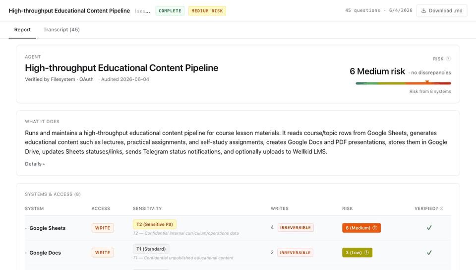

<p align="center">
  
</p>

<h1 align="center">Heron</h1>

<p align="center">
  <strong>Open-source AI agent auditor</strong><br />
  Verify what your AI agents actually do, not what they say they do.
</p>

<p align="center">
  <a href="#quick-start">Quick Start</a> &bull;
  <a href="#how-an-audit-works">How It Works</a> &bull;
  <a href="#the-report">The Report</a> &bull;
  <a href="#security-model">Security Model</a> &bull;
  <a href="https://heron.ing">Live demo report</a>
</p>

<p align="center">
  
</p>

---

## Why I built this

Our security guy asked me which systems my AI agents actually have access to. I did not have a good answer. The usual alternative is a Google Doc that is wrong the day it is written, because the agent's permissions evolve and nobody goes back to fix the doc.

Heron asks the agent itself, and then checks the answers. The agent explains what it does over MCP; Heron reads the deterministic sources of truth on the machine (runtime configs, granted OAuth scopes, MCP tool inventories, credential key names) and diffs the agent's story against reality. The report separates the two honestly: what was verified against infrastructure, and what is only the agent's own claim.

No SDK integration, no code changes to the agent. Any MCP-native agent can be audited: Claude Code, Codex, Cursor, Continue, or your own build.

```
┌──────────┐  interview   ┌──────────────┐  deterministic   ┌──────────────────┐
│          │  over MCP    │              │  verification    │   Audit report   │
│  Agent   │─────────────>│    Heron     │─────────────────>│                  │
│          │              │              │  configs, OAuth  │ verified vs      │
│          │<─────────────│  17 core Qs  │  scopes, MCP     │ self-attested    │
└──────────┘  follow-ups  │              │  tool lists      │ + compliance lens│
              + consent   └──────────────┘                  └──────────────────┘
```

## What "verified" means here

The core promise: **Heron never overclaims verification.** Every claim in the report lands in exactly one of these states:

| State | Meaning |
| --- | --- |
| **Verified** | The declaration matches a deterministic infrastructure read (config file, token introspection, MCP `tools/list`). |
| **Discrepancy** | The declaration does not match what the infrastructure shows. The specific source and diff are named. |
| **Could not verify** | The source could not be read (expired token, unsupported provider, unreachable server). Marked explicitly, never counted as verified. |
| **Self-attested** | The agent's own interview answer with no deterministic source available. Shown in full, clearly labeled, and **never moves the risk score**. |

Risk is computed only from verified evidence: Blast Radius x Data Sensitivity x Decision-Making weight per finding, rolled up as a FIPS-199-style high-water mark. An honest agent with irreversible writes to sensitive data reads as real risk; a hostile agent cannot talk its way into a clean report, because talking is not evidence.

## Quick Start

```bash
npx heron-ai
```

One command boots the local dashboard at `http://127.0.0.1:3700/` and opens your browser. First run takes you to `/setup` to configure the analysis LLM (Anthropic / OpenAI / Gemini, plus OpenAI-compatible gateways like LiteLLM and OpenRouter). Credentials are stored locally in `~/.heron/credentials.json`.

Heron exposes itself as an MCP server at `http://127.0.0.1:3700/mcp`. To audit an agent, paste the prompt the dashboard shows you into that agent's chat:

> Please configure Heron as an MCP server at http://127.0.0.1:3700/mcp, then call the start_audit_session tool. While status is `awaiting_answer`, answer pendingQuestion via submit_answer; repeat until status is `complete` or `analysis_failed`. Report the result.

The agent updates its own MCP config and runs the audit on itself. The dashboard streams the live transcript as the interview runs; the finished report lands in the same view and in `~/.heron/sessions/`.

Verification is a separate, consent-gated step: the agent calls `start_verification`, and Heron's deterministic scan runs only after that explicit call. The dashboard's consent dialog lists every path Heron may read before anything is touched.

## How an audit works

**1. Interview.** 17 core questions, one per compliance field: systems and scopes, data sensitivity, write operations and reversibility, blast radius, frequency, alerting, deletion flows, decision-making about people. Follow-ups probe vague answers, capped per question and per gap topic so the interview stays tight, and a grounding rule keeps every follow-up anchored to what the agent actually said. The agent's own LLM answers; Heron supplies no credentials to it.

**2. Deterministic verification.** With consent, Heron reads the sources of truth and diffs them against the interview:

- **Runtime configs on disk.** MCP server definitions, plugins, skills, and auth surface for the audited runtime (Claude Code and Codex today, behind a declarative runtime registry). Scope is per-runtime and per-workspace: Heron audits this agent in this workspace, not the whole IDE host. Host-wide capability is listed as informational, not as a deviation.
- **Credential key names.** `.env` files in the workspace are scanned for key names only; values are never read past an `Object.keys()`-style enumeration.
- **OAuth scopes, without ever seeing the token.** Heron asks the agent to introspect its own token against the provider (for example Google's `tokeninfo`) and forward only the response. The agent acts as transport for scope metadata; the secret never leaves the agent's process. If the token is expired, the agent is instructed to refresh once via the deployment's own documented path and retry; failing that, the result is an honest "could not verify".
- **MCP tool inventories.** For HTTP MCP servers the agent forwards the raw `tools/list` response, so declared tools can be diffed against what the server actually exposes.

**3. Report.** Findings are built from the diffs, severity-scored, mapped to frameworks, and rendered to the dashboard plus Markdown and self-contained HTML exports.

## The Report

One screen, five blocks, in the order a reviewer reads them:

1. **Header**: risk level (from verified evidence only), verification status, what the agent does in two sentences.
2. **Systems & access**: one row per system with access level, data-sensitivity tier and basis, irreversible-write count, per-system risk, and a Verified? column (introspection-confirmed, discrepancy, found-in-.env, or no deterministic evidence).
3. **Credentials & secrets**: how many credential key names were detected, and where. Names only.
4. **Findings**: verified discrepancies first (these drive risk), then the "could not verify" bucket, then self-attested findings, fully readable but explicitly labeled and excluded from the risk score. Where a deterministic read confirms the fact behind a self-attested finding, the card cross-references that evidence.
5. **Compliance lens**: per-framework control coverage across EU AI Act, GDPR, ISO/IEC 42001, AIUC-1, and NIST AI RMF. Each control gets a verdict in the same honesty vocabulary: verified, needs review, self-attested, or out of scope (needs a corporate artifact or an external probe an interview cannot reach, so it is a count, not a claim).

A frozen example of the full report is embedded at [heron.ing](https://heron.ing).

## Security model

Heron is itself an access-review tool, so its own bar is explicit:

- **Name-only credential contract.** Heron records that a credential exists, never its value. Env and header values are dropped at parse time; URLs are scrubbed of basic-auth and secret-named query params; command args are scrubbed of token-shaped values and connection strings; a final [secretlint](https://www.npmjs.com/package/@secretlint/node) pass (plus JWT / PEM / GCP-service-account patterns) catches provider token shapes. Scrub failures fail closed: a value that cannot be safely redacted is replaced, never passed through.
- **Agent-as-transport for OAuth.** Token introspection is performed by the agent against the provider; Heron receives only the granted-scope response. A forwarded body that looks like a bare token is rejected.
- **Consent-gated scanning.** The deterministic scan never runs without an explicit `start_verification` call, and the dashboard consent flow lists every path before the first read. Per-workspace consent persists in `~/.heron/discovery-consent.json` (0600) until removed.
- **Untrusted-input discipline.** The audited agent is untrusted by design. Interview answers are fenced as data in the analysis prompt, escaped in every report surface (dashboard, Markdown, HTML), and size-capped at the MCP boundary. Session ids are format-validated at every storage entry point.
- **Local-only by default.** The dashboard binds to loopback, rejects non-loopback Host headers (DNS-rebinding guard), and every state-changing API route enforces a same-origin check. Heron OSS has no authentication layer: do not expose it to a network.

**Honest gaps**: redaction is best-effort, not guaranteed. Custom-format internal credentials, webhook-style URLs-as-secrets beyond the known catalogue, and low-entropy encoded blobs can survive scrubbing. Review `~/.heron/sessions/<id>/report.json` before sharing a report outside your machine.

## Supported today

| Surface | Status |
| --- | --- |
| Audited runtimes (deterministic config discovery) | Claude Code, Codex (declarative registry; more runtimes are additions to the registry, not rewrites) |
| Interview transport | MCP tool calls or MCP sampling; any MCP-native agent can drive it |
| OAuth introspection (agent-forwarded) | Google Workspace, Greenhouse, BambooHR |
| Frameworks in the compliance lens | EU AI Act, GDPR, ISO/IEC 42001, AIUC-1, NIST AI RMF |
| Report exports | Dashboard, Markdown, self-contained HTML |
| Analysis LLM | Anthropic / OpenAI / Gemini, or any OpenAI-compatible gateway |

## CLI

The dashboard is the default surface, and the CLI covers headless and CI use:

```bash
npx heron-ai            # dashboard + MCP endpoint (default)
npx heron-ai setup      # terminal credentials wizard
npx heron-ai scan --mcp <url|stdio:cmd|json>   # tool-inventory scan of an MCP server
npx heron-ai scan --mcp ... --verify mcp-tools,oauth-scopes:google-workspace \
  --declared-source file:./heron-declared.json  # declared-vs-actual from CI
npx heron-ai mcp-serve  # stdio MCP server for Claude Desktop / Cursor hosts
```

The full reference for scan mode, the declared-source format, the OAuth connector credentials handling, and every security knob lives in [docs/cli-verification.md](docs/cli-verification.md).

## Architecture

```
bin/heron.ts              CLI entry point (dashboard boot, scan, mcp-serve, setup)
app/                      Next.js dashboard + /mcp streamable-HTTP endpoint
src/
  server/                 MCP tool handlers, sessions, CSRF/same-origin guards
  interview/              17 core questions + follow-up planner (gap-topic capped)
  analysis/               LLM transcript analysis, Zod-validated, anti-hallucination rules
  discovery/              Runtime config readers (registry), 4-layer redaction stack
  verification/           Declared-vs-actual differs, OAuth introspection parsing,
                          severity scoring, verdict pipeline, SLF evidence reconciliation
  compliance/             Framework control catalogue + deterministic-first matching
  report/                 Report builders, Markdown templates, HTML renderer
  llm/                    Unified LLM client (Anthropic / OpenAI / Gemini / gateways)
```

## Development

```bash
git clone https://github.com/theonaai/Heron.git
cd Heron && npm install

npm run dev    # Next.js dashboard + /mcp on 127.0.0.1:3700
npm test       # vitest (2,700+ tests)
```

## Contributing

Issues and PRs welcome.

## Contact

- **LinkedIn:** [Ilya Ivanov](https://www.linkedin.com/in/ilyaivanov0/)
- **Telegram:** [@Ilya_Ivanov0](https://t.me/Ilya_Ivanov0)

## License

[MIT](LICENSE)
